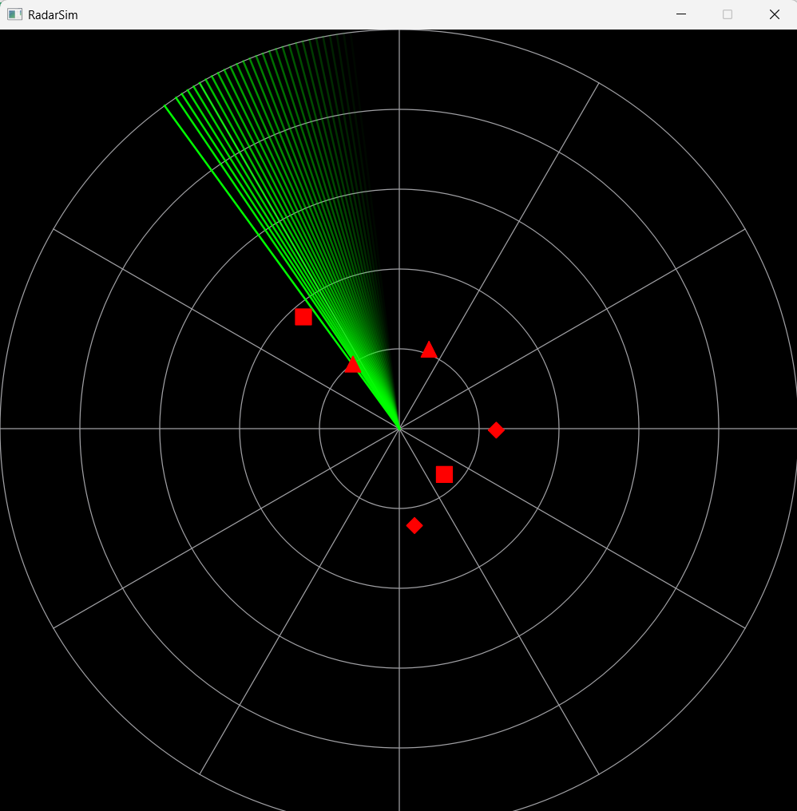

# 🛡️ RadarSim — Air Defense Radar Simulator

A real-time, multithreaded air defense radar simulator built with **C++17** and **Qt 6**.

Simulates a PPI (Plan Position Indicator) radar display tracking aircraft, helicopters, and UAVs in real time. Features IFF (Identification Friend or Foe) classification, threat assessment, and track prediction — all powered by a multithreaded simulation engine with double-buffered snapshot synchronization.



---

## ✨ Features

- **Real-time PPI radar display** with rotating sweep arm and phosphor glow effect
- **Multithreaded simulation engine** — UI thread never blocks
- **50+ simultaneous air targets** (Aircraft, Helicopter, UAV)
- **IFF classification** — Friend / Foe / Unknown
- **Threat assessment** with priority scoring (LOW → CRITICAL)
- **Track prediction** via linear extrapolation
- **JSON-driven scenarios** for flexible testing
- **Double-buffered snapshots** for lock-free UI rendering
- **Unit tested** with Google Test
- **CI/CD** via GitHub Actions

---

## 🏗️ Architecture

```
+----------------------------------------------------+
|                    UI Thread (Qt)                   |
|   RadarWidget  <-- ThreatDisplay  <-- ControlPanel |
+-------------------------^--------------------------+
                          | (signal/slot, queued)
+-------------------------+--------------------------+
|              Simulation Engine (Worker)             |
|   - SimulationClock (tick generator)                |
|   - ObjectManager   (thread-safe container)         |
|   - ThreatAnalyzer  (analysis pipeline)             |
+-------------------------^--------------------------+
                          |
+-------------------------+--------------------------+
|                  Domain Model                      |
|   FlyingObject (abstract)                          |
|     ├── Aircraft                                   |
|     ├── Helicopter                                 |
|     └── UAV                                        |
|   Radar, IFFSystem, TrackPredictor                 |
+----------------------------------------------------+
```

**Key design decisions:**
- **Double-buffering** for thread-safe UI updates without mutex contention
- **Strategy pattern** for interchangeable threat analysis algorithms
- **Factory pattern** for JSON-to-object instantiation

---

## 🔧 Build & Run

### Prerequisites
- C++17 compatible compiler (GCC 9+, MSVC 2019+, Clang 10+)
- Qt 6 (Widgets module)
- CMake 3.16+

### Build
```bash
mkdir build && cd build
cmake ..
cmake --build . --config Release
```

### Run
```bash
./RadarSim                              # default scenario
./RadarSim scenarios/border_patrol.json # custom scenario
```

---

## 🧪 Testing

```bash
cd build
ctest --output-on-failure
```

---

## 📚 Lessons Learned

<!-- TODO: Fill in after development -->

---

## 📄 License

[MIT](LICENSE)
