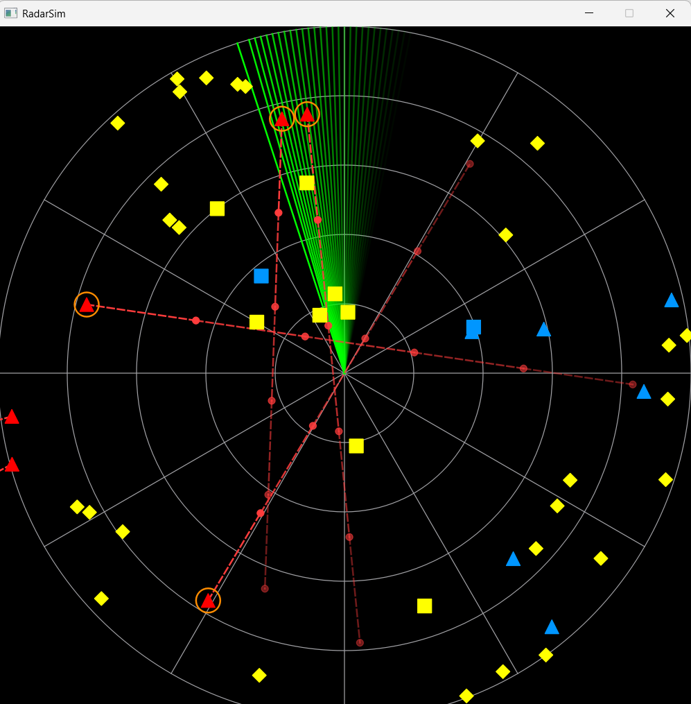

# RadarSim — Air Defense Radar Simulator


A real-time, multithreaded air defense radar simulator built with **C++17** and **Qt 6**.

Simulates a PPI (Plan Position Indicator) radar display tracking 50+ aircraft, helicopters, and UAVs in real time. Features IFF (Identification Friend or Foe) classification, threat assessment, and track prediction — all powered by a multithreaded simulation engine with thread-safe snapshot synchronization.



---

## ✨ Features

- **Real-time PPI radar display** with rotating sweep arm and phosphor glow effect
- **Multithreaded simulation engine** — UI thread never blocks
- **50+ simultaneous air targets** (Aircraft, Helicopter, UAV)
- **IFF classification** — Friend / Foe / Unknown
- **Threat assessment** with priority scoring (LOW → CRITICAL)
- **Track prediction** via linear extrapolation
- **JSON-driven scenarios** for flexible testing
- **Double-buffered snapshots** for lock-free UI rendering
- **Unit tested** with Google Test
- **CI/CD** via GitHub Actions

---

## Architecture

```
┌──────────────────────────────────────────┐
│              UI Thread (Qt)              │
│  RadarWidget                             │
│   sweep · IFF icons · threat rings       │
│   FOE trajectory predictions             │
└──────────────────┬───────────────────────┘
                   │ QMetaObject::invokeMethod
                   │ (Qt::QueuedConnection)
┌──────────────────┴───────────────────────┐
│         Simulation Thread (Worker)        │
│  SimulationEngine (std::thread)           │
│    ObjectManager  (std::shared_mutex)     │
│    Radar::scan → ThreatAnalyzer           │
│    TrackPredictor                         │
└──────────────────────────────────────────┘
              │
┌─────────────┴──────────────────────────────┐
│              Domain Model                   │
│  FlyingObject (abstract)                    │
│    ├── Aircraft   — RCS 1.0, fast           │
│    ├── Helicopter — RCS 0.5, waypoints      │
│    └── UAV        — RCS 0.01, small         │
│  IFFSystem · Radar · ThreatAnalyzer         │
│  TrackPredictor · FlyingObjectFactory       │
└─────────────────────────────────────────────┘
```

**Key design decisions:**

- **Snapshot copy pattern** — simulation thread copies track data into a local vector, releases the mutex, then dispatches to the UI thread via `Qt::QueuedConnection`. The UI never holds a lock during painting.
- **`std::shared_mutex`** — multiple UI reads can proceed concurrently; simulation write blocks readers only during `update()`, not during rendering.
- **Factory + JSON** — `FlyingObjectFactory::create(type, ...)` decouples object construction from scenario loading. Adding a new type requires one new class and one `if` branch.
- **Strategy-ready ThreatAnalyzer** — scoring is isolated in `calcScore()`. Swapping the algorithm requires no changes to callers.

---

## 🔧 Build & Run

### Prerequisites
- C++17 compatible compiler (GCC 9+, MSVC 2019+, Clang 10+)
- Qt 6 (Widgets module)
- CMake 3.16+

### Build
```bash
mkdir build && cd build
cmake ..
cmake --build . --config Release
```

### Run
```bash
./RadarSim                              # default scenario
./RadarSim scenarios/border_patrol.json # custom scenario
```

---

## 🧪 Testing

```bash
cd build
ctest --output-on-failure
```

---

## Lessons Learned

**Hardest problem: thread-safe UI updates without stutter.**
My first approach used a plain `std::mutex` around the entire object list — the UI thread would block during each simulation tick, causing visible frame drops at 50+ targets. The fix was a two-part approach: `std::shared_mutex` allows concurrent reads, and the snapshot-copy pattern ensures the UI thread never holds a lock during painting. The mutex is held only for the duration of copying position data, not for the entire paint cycle.

**Choosing cross-thread notification.**
I evaluated `std::condition_variable` vs Qt's signal-slot for notifying the UI of new data. I went with `QMetaObject::invokeMethod(..., Qt::QueuedConnection)` because it integrates cleanly with Qt's event loop and avoids a separate notification mutex — the queued connection is thread-safe message passing built into Qt.

**Boundary reflection.**
The initial velocity values caused aircraft to exit the 250 km radar range within seconds, making the display nearly empty. The fix — `reflectAtBoundary()` using the outward normal vector `n = pos.normalize()` and the reflection formula `v' = v - 2(v·n)n` — keeps all targets permanently visible while preserving physically plausible motion.

---

## 📄 License

[MIT](LICENSE)
